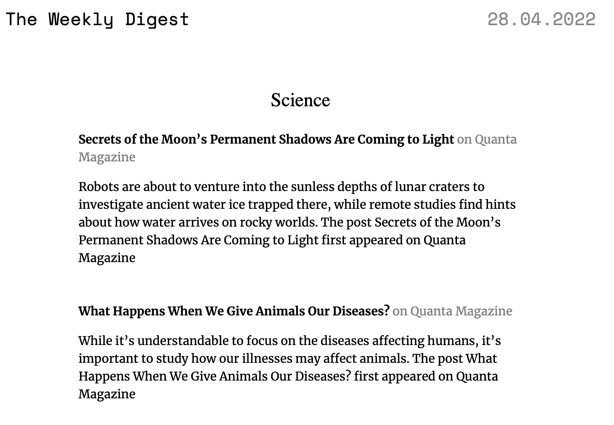

# The Weekly Digest

This is the backend that provides the functionaly for The Weekly Digest.

Every saturday it checks the RSS feeds of all the subscribed users and sends an email digest of the new articles, that looks as follows

The user management functionality is provided by [Shipyard](https://github.com/ZaninAndrea/shipyard-backend).